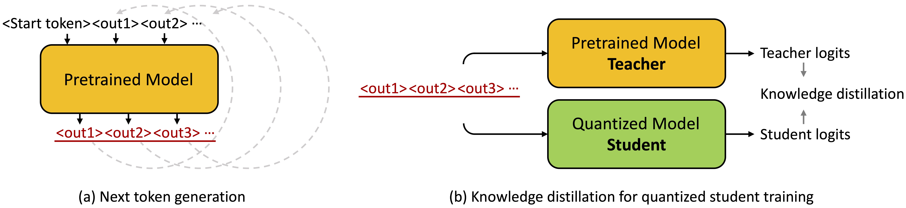

# llm-qat

This repository contains the training code of LLM-QAT introduced in our work: "[LLM-QAT: Data-Free Quantization Aware Training for Large Language Models](https://arxiv.org/abs/2305.17888)"

In this work, we investigate quantization-aware training for LLMs (LLM-QAT). In addition to quantizing weights and activations, we also quantize the KV cache, which is critical for increasing throughput and support long sequence dependencies at current model sizes. We experiment with LLaMA models of sizes 7B, 13B, and 30B, at quantization levels down to 4-bits. We observe up to ~20 points improvement over training-free methods when quantizing weight, activations and kv cache to 4-bit, 8-bit and 4-bit, respectively.

## Citation

If you find our code useful for your research, please consider citing:
    
  @article{liu2023llm,
    title={LLM-QAT: Data-Free Quantization Aware Training for Large Language Models},
    author={Liu, Zechun and Oguz, Barlas and Zhao, Changsheng and Chang, Ernie and Stock, Pierre and Mehdad, Yashar and Shi, Yangyang and Krishnamoorthi, Raghuraman and Chandra, Vikas},
    journal={arXiv preprint arXiv:2305.17888},
    year={2023}
  }
    
## Run

### 1. Requirements:
* python 3.9, pytorch >= 1.13
* pip install -r requirement.txt
* Install apex from source (https://github.com/NVIDIA/apex)
   
### 2. Steps to run:
(1) Synthesize data:
* Download the llama-7B model from [huggingface](https://huggingface.co/decapoda-research/llama-7b-hf). Find it in the huggingface cache and update the path in 'generate_data.py'
* Run `python generate_data.py i` Here `i` is the GPU id, ranging from `0` to `63`, because we use 64 GPUs to synthesize data in parallel. You can also change 'n_vocab 'in your code to adjust the degree of parallelism.
* Run `python merge_gen_data.py` to merge all the generated data in one `.jsonl` file. 

(2) Quantization-aware training:
* Specify the data path and the pre-trained model path in scrips/run.sh file. 
* Run `bash run_train.sh $w_bit $a_bit $kv_bit` E.g. `bash run_train.sh 4 8 4` for 4-bit weight 8-bit activation and 4-bit kv-cache.

## Quantized LLaMA-7B Models
The results reported in the paper is run with the internal LLaMA codebase in Meta. We reproduced our experiments with huggingface codebase and released code here. The results are close to those in the paper. For clearity, we list the zero-shot common sense reasoning accuracy of the opensourced version in the following table.

| #bits (W-A-KV) | boolq | piqa | siqa | hellaswag | winogrande | arc_easy | arc_challenge | obqa | avg. |
| --- | --- | --- | --- | --- | --- | --- | --- | --- | --- |
| 4-8-4   | 72.4 | 76.9 | 47.6 | 70.5 | 65.8 | 67.5 | 44.4 | 50.4 | 62.0 |
| 4-8-8   | 73.6 | 77.4 | 48.5 | 73.0 | 68.8 | 68.4 | 45.5 | 53.4 | 63.6 |
| 4-6-16  | 70.8 | 76.0 | 46.9 | 70.9 | 65.2 | 66.7 | 43.5 | 49.0 | 61.1 |
| 4-8-16  | 72.9 | 77.9 | 47.9 | 72.9 | 68.0 | 69.1 | 44.8 | 55.6 | 63.6 |
| 4-16-16 | 74.2 | 78.2 | 48.3 | 73.3 | 68.2 | 69.7 | 45.6 | 54.8 | 64.0 |
| 8-8-4   | 74.1 | 78.6 | 49.3 | 73.3 | 67.9 | 70.1 | 45.5 | 52.4 | 63.9 |
| 8-8-8   | 75.5 | 79.1 | 48.7 | 75.5 | 70.1 | 73.1 | 47.2 | 56.0 | 65.6 |
| 8-8-16  | 75.7 | 79.1 | 48.9 | 75.8 | 70.4 | 72.8 | 47.8 | 56.3 | 65.9 |

## Acknowledgement

This code is partially based on HuggingFace transformer repo.

## Contact

Zechun Liu, Reality Labs, Meta Inc (zechunliu at meta dot com)

Barlas Oguz, Meta AI (barlaso at meta dot com)

Changsheng Zhao, Reality Labs, Meta Inc (cszhao at meta dot com)

## License

BiT is CC-BY-NC 4.0 licensed as of now.

